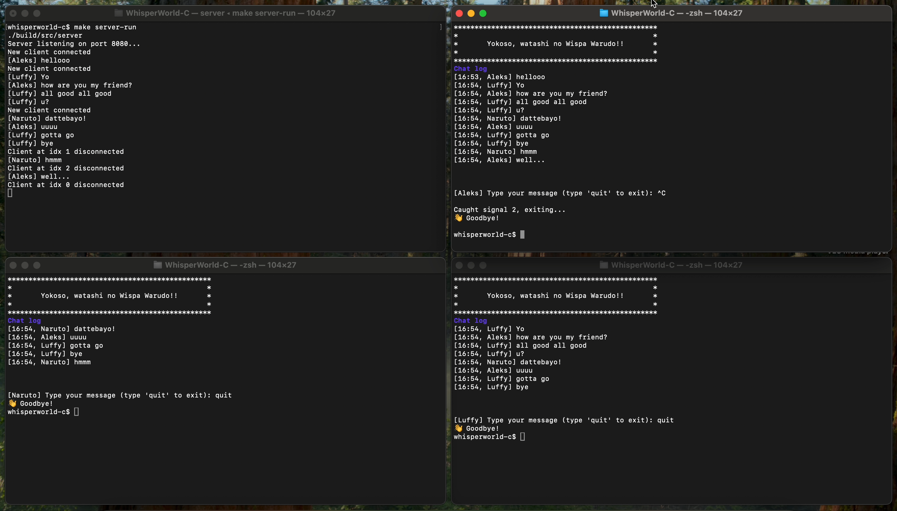

# WhisperWorld (C version)

**WhisperWorld** is a personal project aimed at helping me dive deeper into specific languages and ecosystems. This version focuses on the C programming language, where I seek to strengthen my understanding of system-level programming, network communication, and the internals of TCP/IP. Through this project, I aim to gain a solid grasp of C, including memory management, custom protocol creation, and concurrency handling.

**WhisperWorld-C** is a client-server chat application built in C, utilizing libuv for asynchronous I/O operations. The project explores networking concepts, multithreading, event-driven programming, and the potential for building custom communication protocols.


## Recorder demo (or Screenshot)
*Screenshot is displayed in case the recording fails to load.

<video src="https://github.com/user-attachments/assets/109e9382-789b-4c6f-871e-2612bd03b7fe" autoplay muted loop>
  Video failed to load, here is an image preview.<br />
  
</video>

<br /><br />

## Table of Contents
- [Project Overview](#project-overview)
- [Features](#features)
- [Requirements](#requirements)
- [Getting started](#getting-started)
- [Building](#building)
- [Running the Application](#running-the-application)
- [Running the Server](#running-the-server)
- [Running the Client](#running-the-client)
- [Task breakdown](#task-breakdown)
- [License](#license)

<br /><br />

## Project Overview
WhisperWorld is a project designed to implement a basic TCP client-server model with features like broadcasting messages to multiple clients, managing connections, and handling incoming data asynchronously.<br />
It’s modularized for scalability and ease of maintenance, and uses CMake for building.

## Features
- Multiclient support: Multiple clients can connect to the server simultaneously.
- Message broadcasting: Messages are sent to all connected clients except the sender.
- Asynchronous I/O: Uses libuv for non-blocking, event-driven I/O.
- Cross-platform compatibility: Can run on macOS, Linux, and potentially other platforms.
- Modular Design: Separation of concerns, allowing for future scalability.

<br /><br />

## Requirements
Before starting, ensure you have the following installed:
- CMake (version 3.30 or higher)
- libuv (if not available, it will be fetched automatically)
- GCC or Clang (for compiling the project)

Optional:
- pkg-config (for dependency management)

<br /><br />

## Getting started

1. Clone the repository:<br />
```bash
git clone https://github.com/yourusername/whisperworld.git
cd whisperworld
```

2. Ensure dependencies are available:<br />
Dependencies like libuv will be automatically fetched using CMake.

<br /><br />

## Building

### Using CMake

1. Generate the build files:
```bash
cmake -Bbuild
```
<br />

Build the server and client:
```bash
cmake --build build --target server
cmake --build build --target client
```
<br />

### Using Make

- Using one command:
```bash
make all  # Initialises and builds both server and client
```

- Granular commands:
```bash
make init  # Initialises the build directory and installs dependencies
```
```bash
make server  # Only builds the server
```
```bash
make client  # Only builds the client
```

<br /><br />

## Running the Application

### Running the Server
To start the server:

```bash
make server-run
```
The server will start listening on port 8080 for incoming connections.

### Running the Client
To connect a client to the server:

```bash
make client-run
```
Enter your username and start chatting!

<br /><br />

## Task breakdown

### Phase 1: Project Setup
**Goal:** Set up a simple C project for learning purposes<br />
- [x] Set up initial client-server structure in C using `select()` for handling I/O<br />
- [x] Integrate basic `Makefile` setup.<br />
- [x] Explore chat application fundamentals and message handling<br />

**Result:** Achieved basic chat functionality

<br />

### Phase 2: libuv Integration (Single-Threaded) + Repo improvements
**Goal:** Replace `select()` with `libuv` for better async handling and event-driven architecture.<br />
- [x] Integrated `libuv` for non-blocking I/O and event loop-based operations<br />
- [x] Serialized and deserialized messages between server and clients.<br />

**Result:** Successfully integrated `libuv`, improved async handling, and reduced blocking behavior<br />
---
- [x] Migrate build setup to `CMake` for better cross-platform compatibility<br />
- [x] Update README.md with a more comprehensive set of informations of the whole project<br />

**Result:** Cross-platform support with `CMake`, including fetching dependencies, a license and an improved README<br />

<br />

### Phase 3: Dealing with Edge Cases
**Goal:** Handle edge cases like receiving partial or excess data, error handling, and connection drops.<br />
- [ ] Plan to implement checks for less/more bytes received than expected.<br />

**Result:**: TBD<br />

<br />

### Phase 4: Event Queue & Multithreading
**Goal:** Enhance performance and robustness by introducing an event queue and multithreading.<br />
- [ ] Implement an event queue to ensure messages are processed in the correct order.<br />
- [ ] Add multithreading to handle multiple clients more efficiently.<br />
- [ ] Ensure idempotency in event processing.<br />

**Result:** TBD<br />

<br />

### Phase 5: Custom Protocol Design
**Goal:** Build a custom communication protocol.<br />
- [ ] Design and implement a custom protocol for message serialization/deserialization<br />
- [ ] Abstract protocol to easily switch between different transport layers<br />

**Result:** TBD<br />


<br /><br />

## License
This project is licensed under the MIT License. See the LICENSE file for more details.

